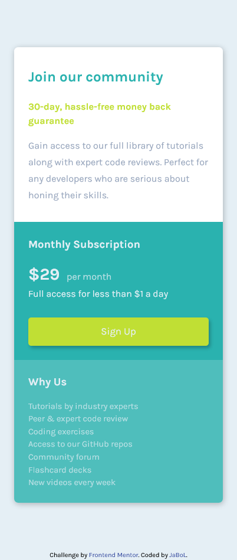
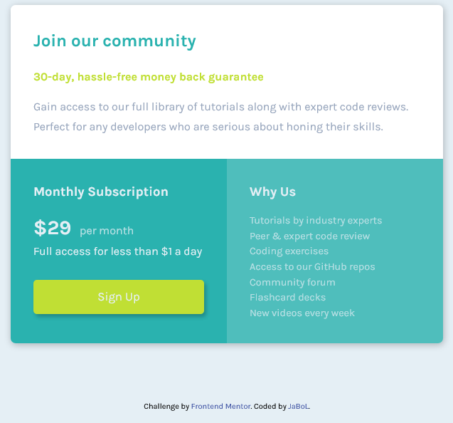

# Frontend Mentor - Single price grid component solution

This is a solution to the [Single price grid component challenge on Frontend Mentor](https://www.frontendmentor.io/challenges/single-price-grid-component-5ce41129d0ff452fec5abbbc). Frontend Mentor challenges help you improve your coding skills by building realistic projects. 

## Table of contents

- [Overview](#overview)
  - [The challenge](#the-challenge)
  - [Screenshot](#screenshot)
  - [Links](#links)
- [My process](#my-process)
  - [Built with](#built-with)
  - [What I learned](#what-i-learned)
  - [Continued development](#continued-development)
  - [Useful resources](#useful-resources)
- [Author](#author)

## Overview

### The challenge

Users should be able to:

- View the optimal layout for the component depending on their device's screen size
- See a hover state on desktop for the Sign Up call-to-action

### Screenshot

### Links

- Solution URL: [GitHub](https://github.com/ErrorRebirth/single-price-grid-component/tree/gh-pages)
- Live Site URL: [Website](https://errorrebirth.github.io/single-price-grid-component/)

## My process

### Built with

- Semantic HTML5 markup
- CSS custom properties
- Flexbox
- CSS Grid
- Mobile-first workflow

### What I learned

In this project, I learned about the importance of creating a responsive website that is optimized for mobile devices. The mobile-first approach is considered to be the best approach because it involves designing for the smaller screen first and then scaling up to larger screens. This is opposed to the desktop-first approach, which involves designing for larger screens first and then scaling down to smaller ones. By starting with the mobile design, you can ensure that the website is easy to use and navigate on smaller devices, and you can also make design decisions that will translate well to larger screens.

I also learned about semantic HTML, which involves using HTML tags that accurately describe the content they contain. This is important because it helps search engines understand the content of a webpage, and it also makes the code easier to read and maintain. I learned about how to do a proper CSS reset, which involves resetting the default styling of HTML elements to ensure that your styles will be applied consistently across different browsers.

In addition, I learned about CSS layout techniques, specifically flexbox and grid layout. Flexbox is a layout module that allows you to create flexible and responsive layouts, while grid layout allows you to create a grid of rows and columns to layout content. These layout techniques are important for creating websites that are visually appealing and easy to use on different devices.

### Continued development

I would like to continue this project in the near future where I want to apply the 
Sass concept rather than the pure css itself. Using Sass in my project is a great way to enhance my coding skills and become more proficient in CSS development. By taking the time to learn and apply Sass, I'll be able to create more efficient and effective stylesheets, and be well-prepared for future projects.

### Useful resources

- [CSS Custom Reset](https://www.joshwcomeau.com/css/custom-css-reset/) - This helped me to create a proper custom css reset.
- [CSS Grid](https://www.youtube.com/watch?v=9zBsdzdE4sM&ab_channel=WebDevSimplified) - This is an amazing youtube video where you will learn the concept of css grid in just 20 minutes.

## Author

- Frontend Mentor - [@CodingDummies](https://www.frontendmentor.io/profile/CodingDummies)
